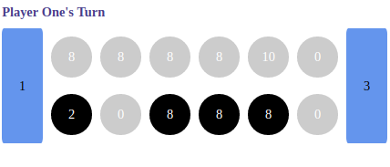
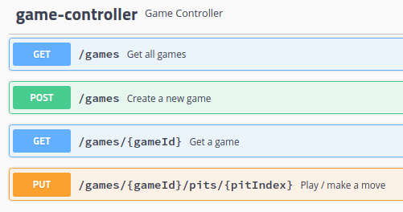
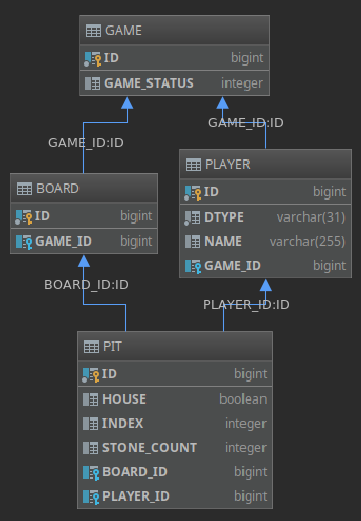

# Kalah Game

## About Kalah
See https://en.wikipedia.org/wiki/Kalah for Kalah rules. This web application runs the six stone variant of Kalah.

<br/>

## Application Overview
__RESTful web service__ built with:

- Java 8
- Spring Boot 2 / Spring 5
- Swagger 
- Hibernate / Spring Data
- H2
- Maven

Tested with JUnit, Mockito, AssertJ

Basic front end built with HTML, CSS, JQuery

<br/>

## Starting the Application
- Run tests with 
```
$ mvn test
```
- To see test coverage, run 
```
$ mvn package
```
and open "target/site/jacoco/index.html"
- Run the application with
```
$ mvn spring-boot:run
```
- After starting the application, visit http://localhost:8080:

<br/>



<br/>

## API Documentation
- After starting the application, visit http://localhost:8080/swagger-ui.html.



<br/>

## ER Model


## Key Classes
- `GameService` - Responsible for game creation and orchestration.
- `StoneDistributionService` - Responsible for moving stones between pits, and assessing game state following move completion.
- `PitResolverService` - Responsible for retrieval of pits based on the supplied pit index, ensuring the current player has permission to access the requested pit. Also calculates the target pit for stone placement.

<br/>

## Design Considerations

DTOs were used to prevent mixing of serialization and persistence logic / annotations, and to prevent changes to the internal domain model from breaking Web Service compatibility.

Domain logic is predominantly housed within the service layer; `GameController` is deliberately thin.

<br/>

## Testing Strategy
In addition to unit test coverage, focus was also given to comprehensive integration test coverage. In particular, the web service was exercised and the game thoroughly tested to ensure game completion is always inevitable, using brute-force to apply random moves in succession until a legitimate move was found, and repeating. See class `IntegrationTests`.

The front end was developed to aid manual testing.

<br/>

## Lessons Learned

### 14 Index Pit Assignment
The pit index assignment system (numbering of pits from 1 to 14) led to complicated pit lookups; if instead they were addressable using a combination of player reference and index, it would have been easier to confirm whether the current player had permission to access a pit. It would also have made things easier to follow, and removed the need to have hard-coded references to the index boundaries for each player in numerous places.

### Testing
It was sometimes difficult to isolate units of code from one another, suggesting components are too tightly coupled, and the tests were not as independent from one another as I would have liked. This may have been alleviated by an improved game state-mocking utility.

### Manual Testing / Front End
Manual Testing with the front end proved to be invaluable, in particular, when confirming that pits were being populated correctly; this was much more straight forward when able to visualise the board.


